# Cash Register App

Cash Register App is a mobile platform application designed to manage shopping and sales operations efficiently.

## Table of Contents

- [Features](#features)
- [Installation](#installation)
- [Usage](#usage)
- [Screenshots](#screenshots)
- [Contributing](#contributing)
- [License](#license)
- [Authors](#authors)
- [Acknowledgements](#acknowledgements)

## Features

- User login and registration
- Product catalog and price checking
- Sales and return processing
- Receipt generation and printing
- User profile management
- Sales reports and analytics
- Barcode scanning with sound and vibration feedback
- NFC support for additional functionalities

## Installation

1. **Clone the repository, navigate to the project directory, install the dependencies, and start the application:**
   ```bash
    git clone https://github.com/KursadEren/CrashRegisterApp.git
-  **dependencies**
-    "@babel/preset-react": "^7.24.7",
-   "@babel/preset-typescript": "^7.24.7",
-    "@mgcrea/vision-camera-barcode-scanner": "^0.11.2",
-    "@react-native-async-storage/async-storage": "^1.23.1",
-    "@react-native-community/cli": "^13.6.9",
-    "@react-native-community/cli-server-api": "^13.6.9",
-    "@react-navigation/bottom-tabs": "^6.5.20",
-    "@react-navigation/native": "^6.1.17",
-    "@react-navigation/native-stack": "^6.9.26",
-    "@react-navigation/stack": "^6.3.29",
-    "axios": "^1.6.8",
-    "cors": "^2.8.5",
-    "express": "^4.19.2",
-    "http-proxy-middleware": "^3.0.0",
-    "i18next": "^23.11.5",
-    "intl": "^1.2.5",
-    "intl-pluralrules": "^2.0.1",
-    "latest-version": "^9.0.0",
-    "react": "18.2.0",
-    "react-i18next": "^14.1.2",
-    "react-native": "0.73.6",
-    "react-native-biometrics": "^3.0.1",
-    "react-native-chart-kit": "^6.12.0",
-    "react-native-file-viewer": "^2.1.5",
-    "react-native-fs": "^2.20.0",
-    "react-native-gesture-handler": "^2.17.1",
-    "react-native-html-to-pdf": "^0.12.0",
-    "react-native-image-picker": "^7.1.2",
-    "react-native-nfc-manager": "^3.15.0",
-    "react-native-openanything": "^0.0.6",
-    "react-native-paper": "^5.12.3",
-    "react-native-reanimated": "^3.12.1",
-    "react-native-safe-area-context": "^4.9.0",
-    "react-native-screens": "^3.30.1",
-    "react-native-svg": "^15.3.0",
-    "react-native-swipe-gestures": "^1.0.5",
-    "react-native-thermal-receipt-printer": "^1.2.0-rc.2",
-    "react-native-vector-icons": "^10.1.0",
-    "react-native-vision-camera": "^4.3.2",
-    "uri-js": "^4.2.2"

-  node version : v21.6.2

    ```bash
   cd cash_register_app
   npm install
   npm start
   npm run android # For Android
   npm run ios     # For iOS


  
   cd src/GroceryData
   json-server --watch users.json --port 3002
   json-server --watch e-commerce-data-set.json --port 3001
   node server.js
   
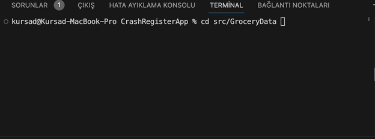
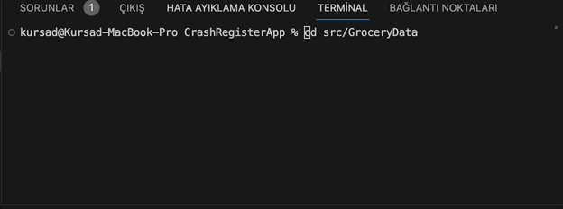
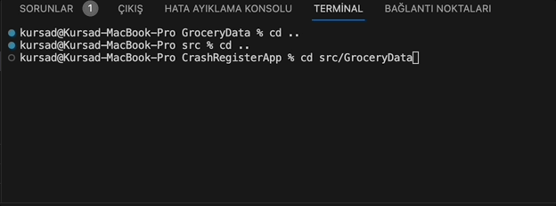
Usage

1. **Login Screen**
- Users can log in using their credentials.
- Supports biometric authentication for faster login.

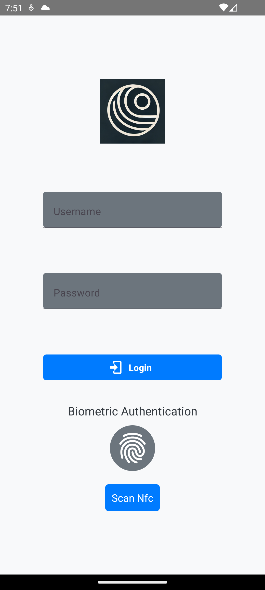

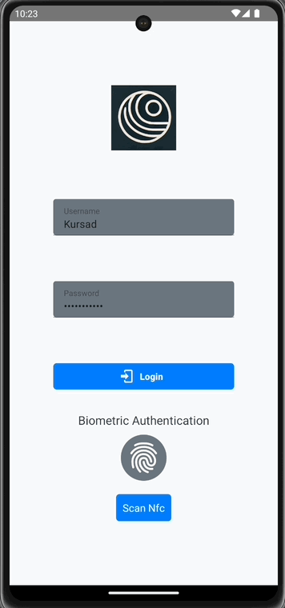


2. **Home Screen**
- Displays a welcome message with the logged-in user's name.
- Provides quick access to various functionalities such as the product catalog, sales, and reports.
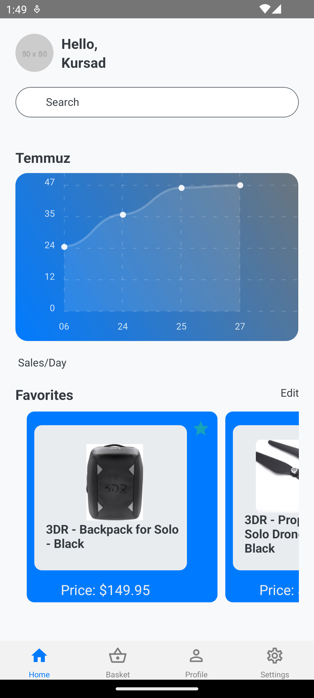

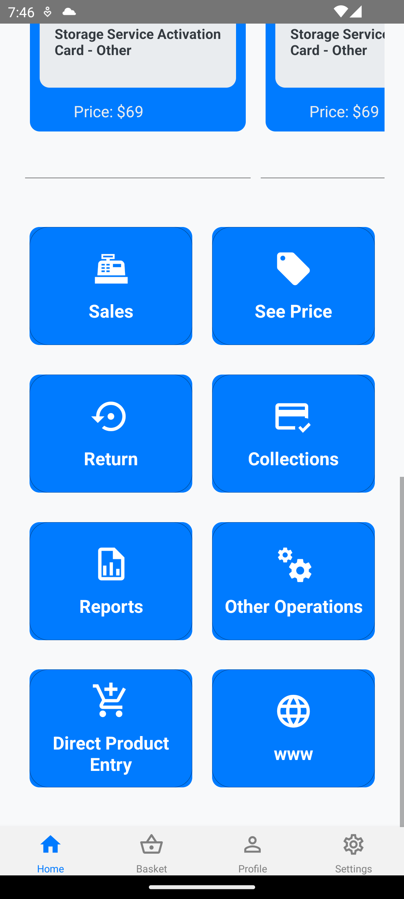

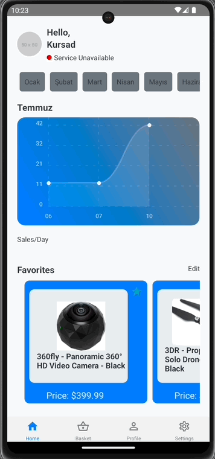

3. **Product Catalog**
- Lists all available products with details.
- Users can check prices and add products to the cart.
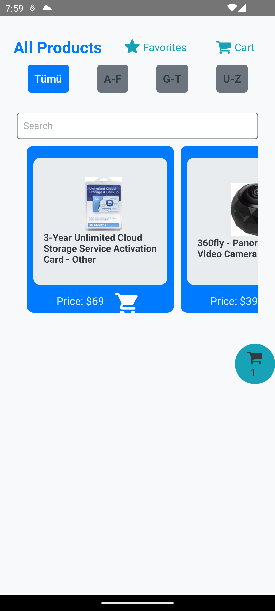

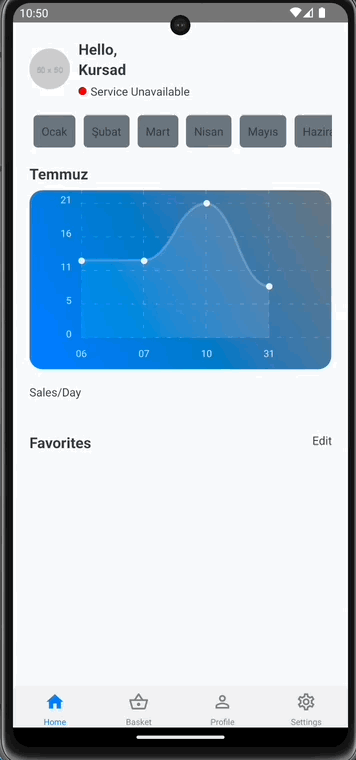


4.  **Sales and Return Processing**
- Facilitates the sales process, including adding items to the basket and completing transactions.
- Supports return operations with proper validation.

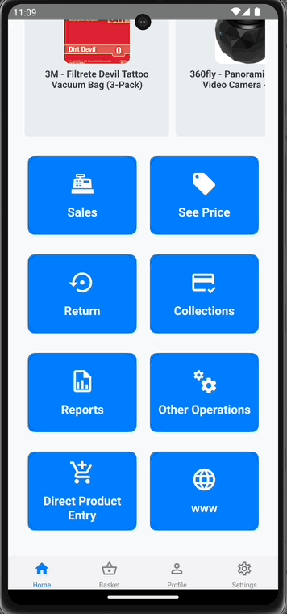


5. **Reports**
- Generates sales reports and analytics.
- Users can view detailed reports and export them as PDFs.
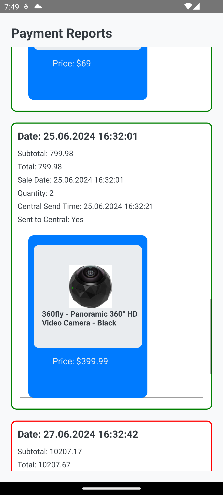

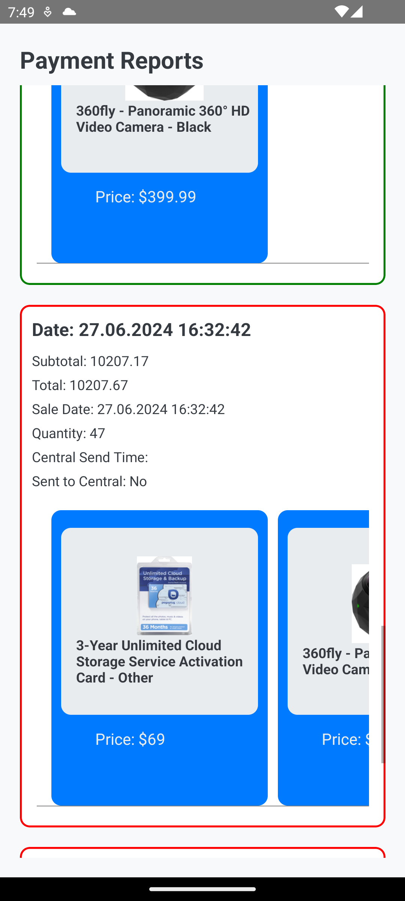

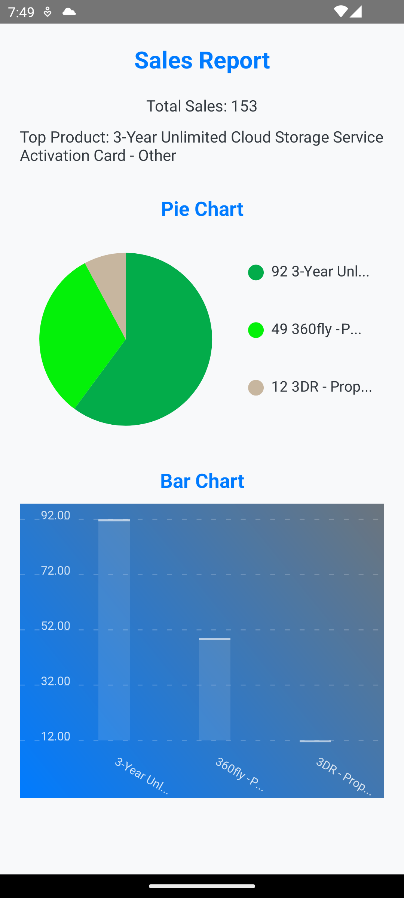

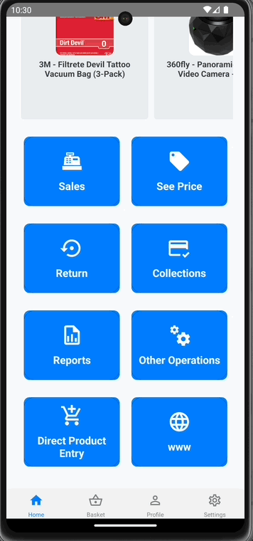


6. **Settings**
- Allows users to change application settings, including theme and language preferences.

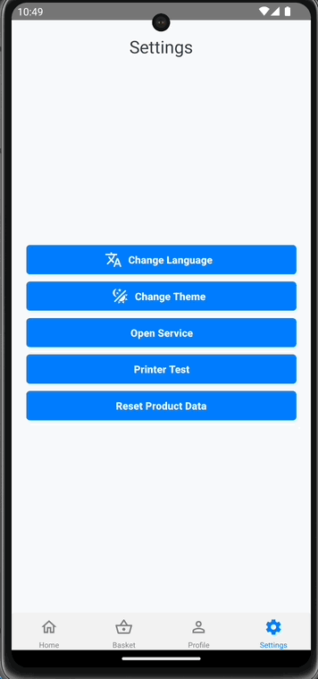


 **Author** : Kürşad Eren Maden
